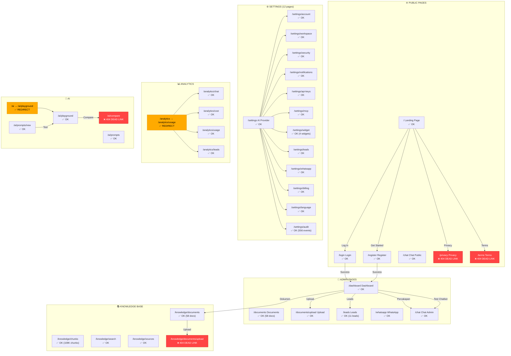

# MimoNotes — Full Navigation Audit Report

**Date:** 2026-06-21
**URL:** https://mimotes.ekohomelab.online
**Crawl method:** Playwright recursive navigation + DOM extraction
**Total pages crawled:** 42 unique routes
**Auth state:** Logged in as admin@mimotes.com

---

## Ringkasan Temuan

| Metrik | Jumlah |
|--------|--------|
| Total halaman di-crawl | 42 |
| Halaman berfungsi | 36 |
| Dead link (404) | 4 |
| Halaman redirect | 2 |
| Isu navigasi | 6 |

---

## Dead Links (404)

| # | Halaman Asal | Tombol/Tautan | Halaman Tujuan | Status |
|---|-------------|---------------|----------------|--------|
| DL-1 | Landing (footer) | "Privacy" link | `/privacy` | **404 — This page could not be found.** |
| DL-2 | Landing (footer) | "Terms" link | `/terms` | **404 — This page could not be found.** |
| DL-3 | Sidebar "Documents" → sub-nav | "Upload" button path | `/knowledge/documents/upload` | **404 — Route doesn't exist.** Correct path: `/documents/upload` |
| DL-4 | AI Playground | "Compare" button | `/ai/compare` | **404 — Route doesn't exist.** Compare feature not implemented. |

### Analisis Dead Links

1. **`/privacy` & `/terms`** — Halaman ini di-link dari footer landing page tapi tidak ada route-nya di Next.js. Kemungkinan belum diimplementasi atau lupa ditambahkan.

2. **`/knowledge/documents/upload`** — Sidebar navigation mengarah ke path ini, tapi upload page sebenarnya ada di `/documents/upload`. Ini routing mismatch antara sidebar link dan route yang ada.

3. **`/ai/compare`** — Tombol "Compare" di AI Playground mengarah ke route ini tapi halaman belum diimplementasi.

---

## Redirect

| Halaman Asal | Redirect Ke | Keterangan |
|-------------|-------------|------------|
| `/analytics` | `/analytics/usage` | Root analytics redirect ke usage |
| `/ai` | `/ai/playground` | Root AI redirect ke playground |

---

## Peta Navigasi Lengkap

### PUBLIC PAGES (No Auth Required)

```
/ (Landing Page)
├── /login → Login Form
│   └── [Masuk] → /dashboard (success) / stay (fail, no error msg)
├── /register → Register Form
├── /chat → Chat Page (public, no auth)
│   ├── [Session buttons] → load conversation
│   ├── [Chat Baru] → new session
│   ├── [Suggested prompts] → send message
│   └── [Mode selector] → CS / KB / Sales
├── /privacy → ❌ 404 DEAD LINK
└── /terms → ❌ 404 DEAD LINK
```

### ADMIN PAGES (Auth Required)

```
/dashboard
├── [Dokumen card] → /knowledge/documents
├── [Percakapan card] → /chat
├── [Leads card] → /leads
├── [Upload Dokumen] → /knowledge/documents/upload
├── [Test Chatbot] → /chat
└── [Lihat Leads] → /leads

/documents
├── [Document rows] → detail pages
├── [Upload button] → /documents/upload
└── [58 documents listed]

/documents/upload
├── [File Upload tab] → drag & drop / select files
├── [URL Import tab] → import from URL
├── [Select Files] → file picker
└── [Upload Dokumen] → submit upload

/leads
├── [CSV export] → download CSV
├── [Filter: status] → All/New/Contacted/Qualified/Converted/Lost
├── [Filter: source] → All/WhatsApp
├── [Lead rows] → individual lead actions
└── [11 leads listed]

/whatsapp
└── [Content area] → WhatsApp integration page

/chat
├── [Sidebar: session list] → load conversation
├── [Chat Baru] → new session
├── [Mode selector] → 💬 Customer Service
├── [Input field] → type message
├── [Suggested prompts] → quick start
│   ├── "Apa saja dokumen yang tersedia?"
│   ├── "Jelaskan isi dokumen utama"
│   └── "Buatkan ringkasan dari semua dokumen"
└── [Follow-up buttons] → context actions
```

### SETTINGS (12 Sub-pages)

```
/settings (AI Provider Config)
├── /settings/account → Profile & account info
├── /settings/workspace → Workspace name, members, roles
├── /settings/security → Password change, session history
├── /settings/notifications → Email/Telegram/Discord alerts
├── /settings/api-keys → API key management
├── /settings/mcp → MCP server configuration
├── /settings/widget → Widget management (4 widgets)
├── /settings/leads → Lead settings
├── /settings/whatsapp → WhatsApp integration
├── /settings/billing → Plan, invoices, usage
├── /settings/language → Bahasa Indonesia / English
└── /settings/audit → Audit logs (556 events/30d)
```

### KNOWLEDGE BASE (4 Pages)

```
/knowledge/documents → Document list (58 docs, 108K chunks)
├── [Document rows] → detail view
├── [Folder tab] → folder view
├── [Filter: status] → All/Ready/Processing/Failed
└── [Filter: type] → PDF/DOCX/TXT/CSV/XLSX/URL/IMAGE

/knowledge/chunks → Chunk browser (108,595 chunks)
├── [Chunk rows] → expand content
└── [Search] → search chunks

/knowledge/search → Similarity search tool
├── [Query input] → search query
├── [Top-K selector] → 3/5/10/15/20
├── [Threshold selector] → 0.3-0.8
└── [Document filter] → specific doc or all

/knowledge/sources → Source tracking (108 references)
├── [Sort] → Most Referenced/Title/Most Chunks/Recently Used
└── [Source list] → usage frequency
```

### ANALYTICS (4 Pages)

```
/analytics → redirect → /analytics/usage

/analytics/chat → Chat metrics
├── [Time range] → 7D/30D/90D
├── [KPIs] → Total Sessions, Today's, Avg Msgs, Source Rate
└── [Charts] → Chat Volume, Response Time

/analytics/cost → Cost tracking
├── [Time range] → 7D/30D/90D
├── [KPIs] → Estimated Cost, Avg Cost/Query, Tokens
└── [Charts] → Cost Over Time

/analytics/usage → Platform usage
├── [Time range] → 7D/30D/90D
├── [KPIs] → Documents, Sessions, Users, Uploads, Searches
└── [Charts] → Activity Over Time

/analytics/leads → Lead analytics
├── [Time range] → 7D/30D/90D
├── [KPIs] → Total Leads, Conversion Rate, High-Intent
└── [Charts] → Leads by Status, Intent Distribution
```

### AI (3 Pages)

```
/ai → redirect → /ai/playground

/ai/playground → AI Playground
├── [System Prompt textarea]
├── [Context/RAG toggle]
├── [User Message textarea]
├── [Run button] → execute prompt
├── [Save as Template] → save to prompts
├── [Compare] → ❌ 404 DEAD LINK
├── [Clear] → reset
└── [Parameters] → Temperature, Top P, Max Tokens

/ai/prompts → Prompt templates
├── [Filter tabs] → All/General/Support/Sales/Technical
├── [Search] → search prompts
├── [New Prompt] → /ai/prompts/new
└── [Create First Prompt] → /ai/prompts/new

/ai/prompts/new → Create prompt
├── [Back] → /ai/prompts
├── [Test] → /ai/playground?promptId=
├── [Create] → save prompt
├── [Name input]
├── [Category selector]
├── [System Prompt textarea]
└── [Preview panel]
```

### SIDEBAR NAVIGATION (Global)

```
Sidebar Nav:
├── [New Chat] → /chat
├── Dashboard → /dashboard
├── Chat → /chat
├── Documents → /knowledge/documents
├── Knowledge → /knowledge/search
├── Leads → /leads
├── Analytics → /analytics/leads
├── WhatsApp → /whatsapp
├── Settings → /settings
└── AI → /ai
```

---

## Peta Visual (Mermaid)



---

## Isu Navigasi

### NAV-1: Dead Link — `/privacy` (404)
- **Asal:** Landing page footer → "Privacy"
- **Severity:** HIGH
- **Impact:** User klik Privacy policy → halaman 404. Unprofessional, potential legal issue.

### NAV-2: Dead Link — `/terms` (404)
- **Asal:** Landing page footer → "Terms"
- **Severity:** HIGH
- **Impact:** User klik Terms of Service → halaman 404. Unprofessional, potential legal issue.

### NAV-3: Dead Link — `/knowledge/documents/upload` (404)
- **Asal:** Document page internal link
- **Severity:** MEDIUM
- **Impact:** Upload button di knowledge page mengarah ke route yang tidak ada. Correct path: `/documents/upload`.

### NAV-4: Dead Link — `/ai/compare` (404)
- **Asal:** AI Playground → "Compare" button
- **Severity:** MEDIUM
- **Impact:** Fitur Compare belum diimplementasi tapi tombol sudah ada.

### NAV-5: Login error feedback
- **Asal:** `/login`
- **Severity:** HIGH
- **Impact:** Login gagal tanpa error message. User tidak tahu salah password atau ada error.

### NAV-6: Duplicate conversation entries
- **Asal:** `/chat` sidebar
- **Severity:** LOW
- **Impact:** Sidebar penuh dengan duplicate entries. Same question creates multiple sessions.

---

## statistik Halaman

| Kategori | Jumlah | Status |
|----------|--------|--------|
| Public pages | 6 | 4 OK, 2 DEAD |
| Admin pages | 6 | 6 OK |
| Settings | 12 | 12 OK |
| Knowledge Base | 5 | 4 OK, 1 DEAD |
| Analytics | 5 | 4 OK, 1 REDIRECT |
| AI | 4 | 3 OK, 1 DEAD, 1 REDIRECT |
| **Total** | **38 unique** | **32 OK, 4 DEAD, 2 REDIRECT** |

---

*Report generated by gstack QA navigation audit — Playwright recursive crawl*
